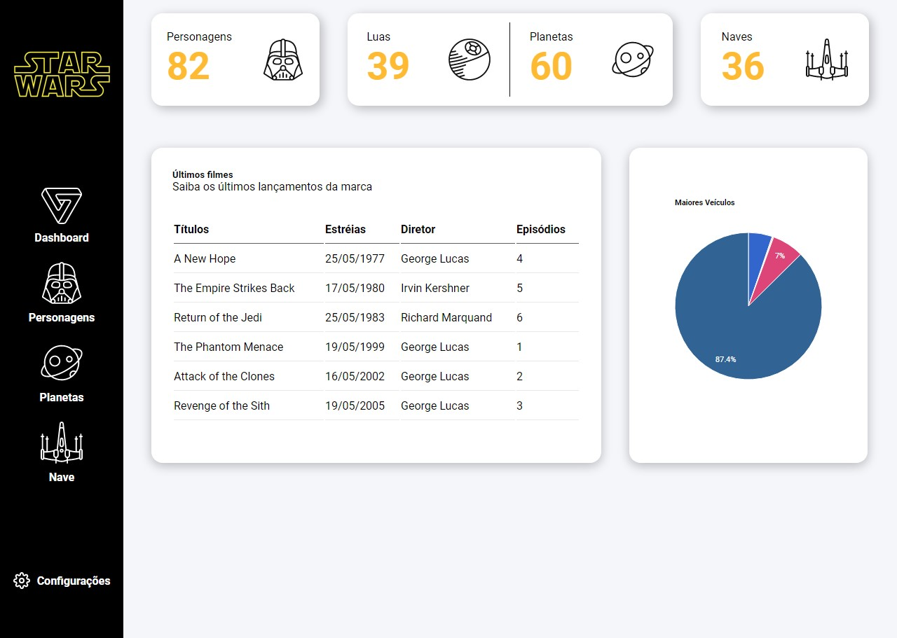

<h1 align="center">
  
</h1>

<p align="center">Site desenvolvido com apoio da <strong>Isadora Stangarlin, do @papodedev,</strong> para propósito de estudo.</p>
<p align="center">Clique <a href="https://igormartins4.github.io/wikistar/">aqui</a> para ver o site.</p>

<p align="center">
<a href="https://github.com/igormartins4/wikistar/graphs/contributors">
 
  </a>

  <a href="https://github.com/igormartins4/clone-vercel-homepage/stargazers">

  </a>

<a href="https://github.com/igormartins4/wikistar/network">

  </a>


  <a href="https://github.com/igormartins4/clone-vercel-homepage/blob/main/LICENSE">

  </a>
</p>

<hr>

## Sumário
- <a href="#autor">Autor</a>
- <a href="#tecnologias">Tecnologias</a>
- <a href="#acessar-o-projeto">Acessar o projeto</a>
- <a href="#projeto">Projeto</a>
- <a href="#layout">Layout</a>
- <a href="#licença">Licença</a>
- <a href="#funcionalidades-extras">Funcionalidades Extras</a>

## Autor

| [<br><sub>@igormartins4</sub>](https://github.com/igormartins4) |
| :---: |

<br>

<p align="center">

</p>

## Tecnologias

Esse projeto foi desenvolvido com as seguintes tecnologias:

- HTML
- CSS
- JavaScript
- Imagens SVG
- StarWars API (swapi)
- jQuery
- Google Charts
- Moment.js
- Axios
  
## Acessar o projeto

Você pode clicar <a href="https://igormartins4.github.io/wikistar/">aqui</a> para acessar o site do projeto ou seguir os passos abaixo para rodar-lo localmente em sua máquina.

1. Abra o terminal na pasta desejada para clonar o repositório e execute o comando:

```bash
git clone https://github.com/igormartins4/wikistar.git
```

2. Abra a pasta do repositório _wikistar_.
   
3. Depois de concluído, abra o arquivo _index.html_ e o site irá começar funcionar.

## Projeto

O _WikiStar_ é um site simples para ver algumas estatisticas e curiosidades da franquia de filmes Star Wars. Para isso, foi usado a Swapi (StarWars API) para obter as informações.
## Layout

Você pode visualizar o layout do projeto através [desse link](https://www.figma.com/file/MTmILmnLdsmesAGyGTRvV4/star-wars?node-id=0%3A1). Não é necessário ter conta no [Figma](https://figma.com) para acessá-lo.

## Licença

Esse projeto está sob a licença MIT. Veja o arquivo [LICENSE](LICENSE.md) para mais detalhes.

## Funcionalidades Extras
🚧 Ainda em construção... 🚧
- [ ] Funções para o menu lateral
- [ ] Responsividade
- [ ] Configurações
- [ ] Modo Noturno

<hr>

<h3 align="center" >Bora fazer aquele networking maroto?</h3>
<p align="center">
    <a href="https://www.linkedin.com/in/igormartins44/">LinkedIn</a> |
    <a href="https://www.instagram.com/titan.css">Instagram</a> |
    <a href="https://www.behance.net/titanstudio44">Behance</a>
</p>

<br />
<p align="center">
    Desenvolvido com 💜 por Igor Martins
</p>
